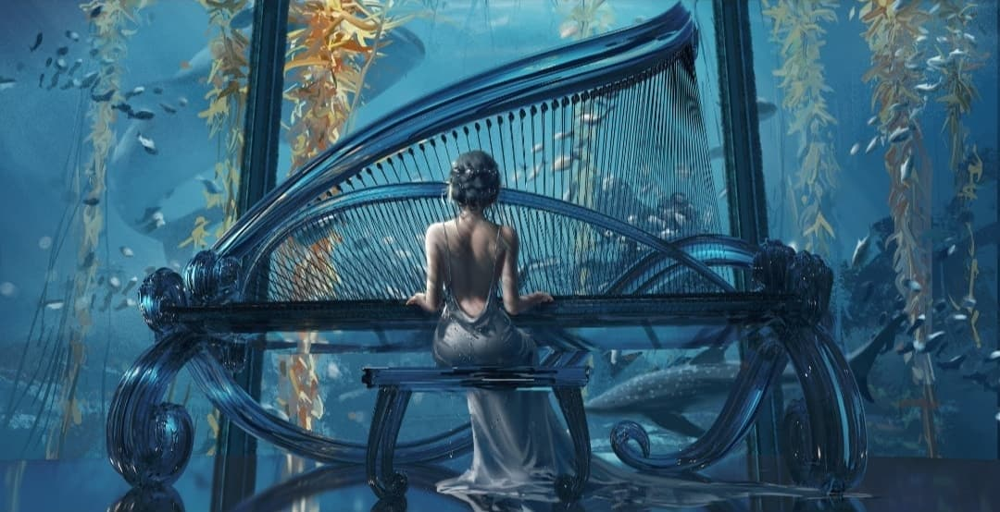

# 关于我

很久以前就开始接触博客，那时候只是觉得博客挺有意思的，但是无奈自己完全不会编程方面的知识就尝试一下放弃。
过了好久我发现了VPN这个新世界的大门，我在youtube上看到了博客的教程和好多好看的主题，再一次的开始尝试，这次是成功了不过完全没得内容就是瞎搞搞主题样子。
在这期间我也算是入门了吧，毕竟我知道了一些简单的代码啥意思，不过到现在我也不会写。也就能看懂会抄。

> HTML、css、js、php

2017灾难的一年，开始全面封杀VPN我也就再一次的和博客告别了

事到如今，期间断断续续的买过TYPECHO、Wordpress等主题各种服务器域名啥的，花了我小几千(っ °Д °;)っ

原创内容寥寥无几，基本都是复制别人的，有的也是一些主题美化相关的，现在看来那些基本没啥实际性的价值。

> 黑历史就让永存吧(ಥ _ ಥ)  
> 仅保留还有用的内容(￣ ‘i ￣;)

