很多站长会经常的更换服务器，毕竟优惠是很多小站长的优选。比如说我网站数据转移其实了也并不难，只要记住自己使用的那些服务。一下举例说明整个过程。

### 宝塔面板

在备份之前我们要查看自己使用的PHP版本、MySQL版本、Apache版本或Nginx版本和PHP安装的扩展插件。还有一个不要忘记看了，MySQL 的编码是什么`utf8`还是`utf8mb4`

```shell
### PHP版本
PHP7.4
### 安装的扩展插件
opcache、memcached、redis、imagemagick
### MySQL版本
MySQL 5.7.32
### Nginx版本
Nginx 1.18.0
```

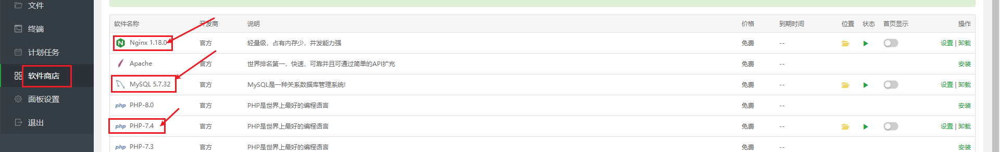

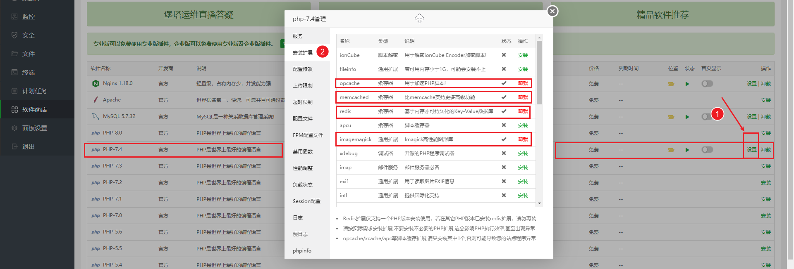

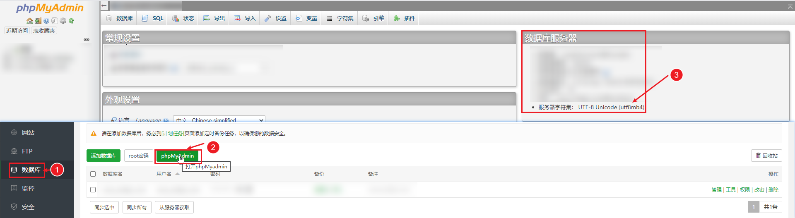

> 现在可以使用宝塔面板对网站进行备份和数据库备份。

#### 备份网站

在宝塔面板——网站——备份（点击无备份）——点击备份站点——等待备份完成下载备份文件

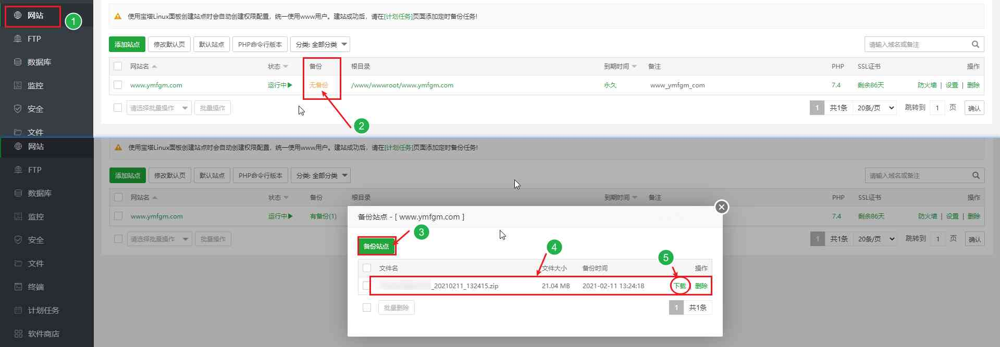

#### 备份数据库

在宝塔面板——数据库——备份（点击无备份）——点击备份数据库——等待备份完成下载备份文件

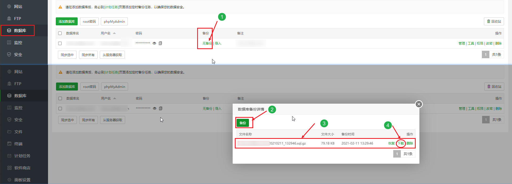

**以上做完备份就结束了**

### 域名解析

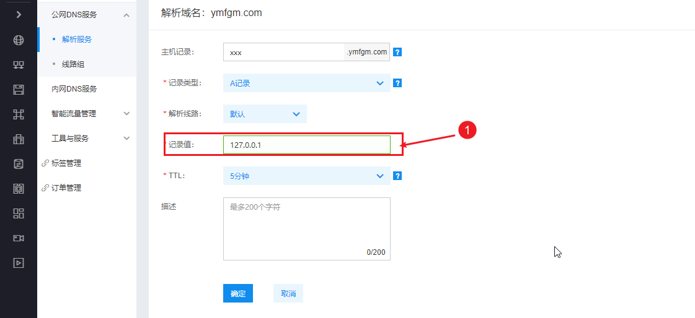

在你的域名服务商修改之前的服务器ip地址为新的ip地址

### 安装宝塔面板

在新的服务器上安装宝塔面板：[网站地址](https://www.bt.cn/bbs/thread-19376-1-1.html)

```shell
### Centos安装命令：
yum install -y wget && wget -O install.sh http://download.bt.cn/install/install_6.0.sh && sh install.sh
```

等待宝塔面板安装完成并保存宝塔面板链接和账号密码

#### 安装PHP版本、MySQL版本、Apache版本或Nginx版本

- 按照之前记录的版本来设置安装各个的版本（建议一样）
- 安装完成在安装PHP的扩展插件，等待安装完成

#### 新建网站

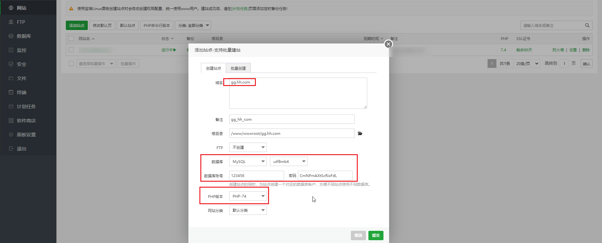

新建网站——输入你的域名——按照你的设置数据库——PHP——点提交

#### 上传备份文件

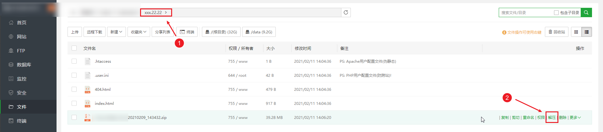

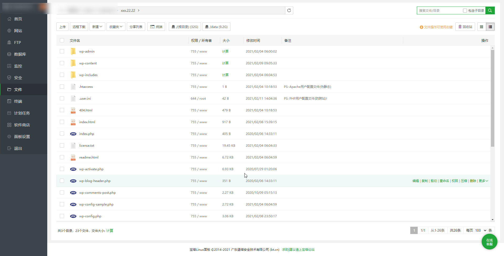

- 上传zip结尾的网站备份文件到网站根目录并解压
- 找到wp-config.php文件，修改数据库用户名和密码
- 修改完成保存

```php
### 文件大概23-40行

// ** MySQL 设置 - 具体信息来自您正在使用的主机 ** //
/** WordPress数据库的名称 */
define( 'DB_NAME', 'huimaozahuopu' );  // 修改数据库用户名

/** MySQL数据库用户名 */
define( 'DB_USER', 'huimaozahuopu' );  // 修改数据库用户名

/** MySQL数据库密码 */
define( 'DB_PASSWORD', '123456789' );  // 修改数据库密码

/** MySQL主机 */
define( 'DB_HOST', 'localhost' );

/** 创建数据表时默认的文字编码 */
define( 'DB_CHARSET', 'utf8mb4' );  // MySQL文字编码

/** 数据库整理类型。如不确定请勿更改 */
define( 'DB_COLLATE', '' );
```

#### 导入数据库

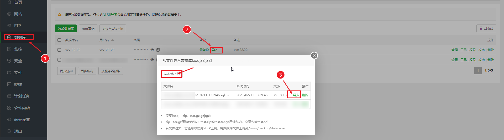

数据库——导入——从本地上传之前保存的数据库备份文件（sql.gz结尾文件）——上传完成点击导入等待导入完成

#### 网站设置

- 如果之前开启了https那么在宝塔里面开启https
- 如果设置了伪静态那么也要设置伪静态

### 查看网站

访问域名查看能否正常访问。

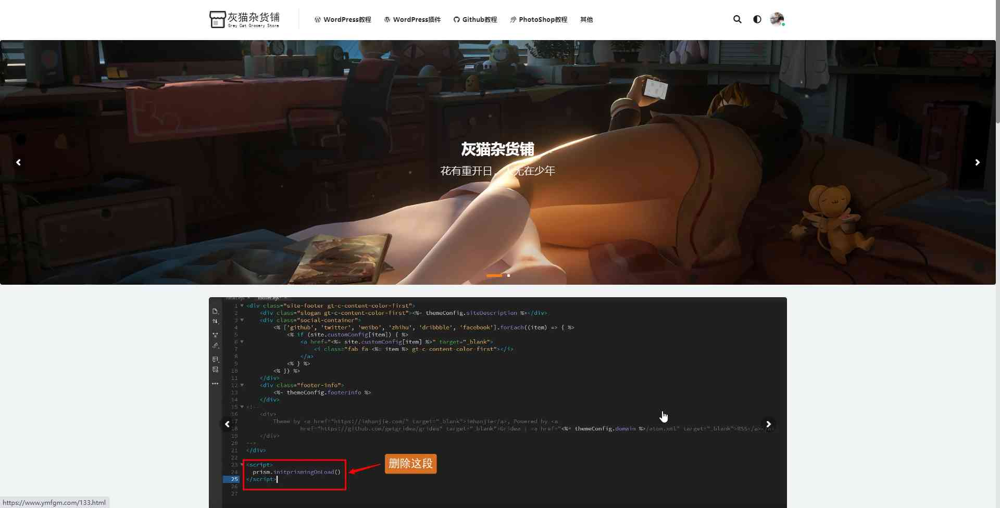

### 小结：

- 如果不想后期的修改数据库用户名和密码，那么备份数据库的时候记录数据库的用户名和密码
- 如果打开网站出现错误，是不是之前安装了缓存插件，缓存没有里清理，清理一下缓存即可
- 网站进入不了后台无法清理缓存，一下提供代码清理

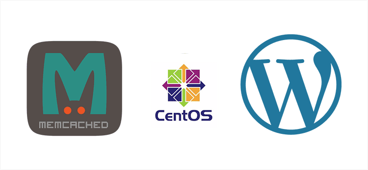

```shell
### 在Linux服务器上如果没有安装telnet的话需要自己手动安装一次
yum install telnet telnet-server
### 下面的命令就可以清理Memcached缓存信息了。
telnet localhost 11211
flush_all
ctrl + ] //回车，输入这个后才能退出
quit //退出
```

```shell
### 下面的就是实际操作显示的步骤
[root@localhost ~]# telnet localhost 11211
Trying 127.0.0.1...
Connected to localhost.
Escape character is '^]'.
flush_all
OK
ctrl + ]
quit
Connection closed by foreign host.
[root@localhost ~]#
```
