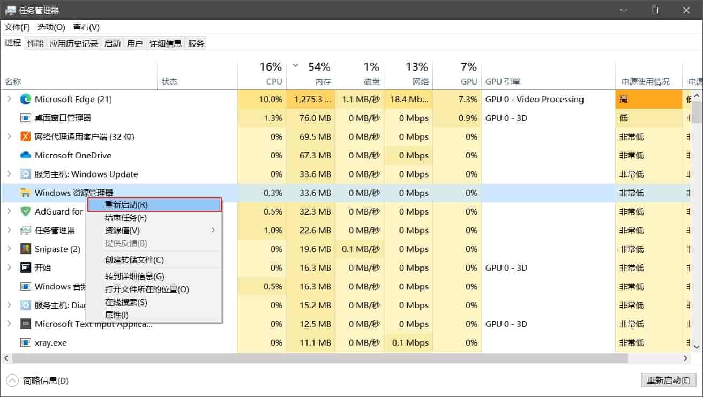
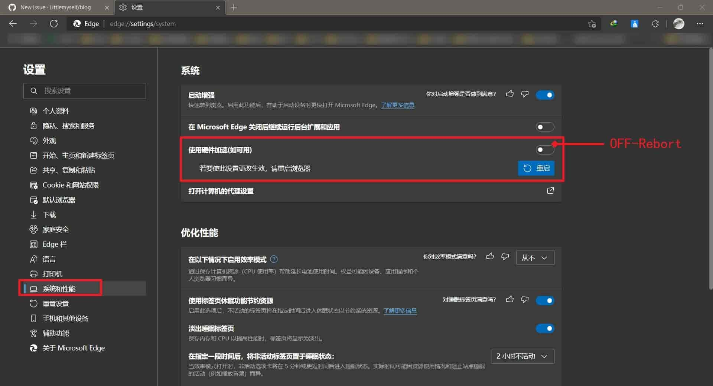

### windows10输入法打字没有选字框

重启windows资源管理器即可

### 简体中文美式键盘删除

有时候电脑会莫名其妙的多出了一个简体中文美式键盘,完全就没啥用

`WIN+R`输入`regedit`打开注册表编辑器:`计算机\HKEY_CURRENT_USER\Keyboard Layout\Preload`里面有多个项目

- 可以一个一个删除`重启电脑`查看是否删除
- 也可以只保留`默认`其他几个都删除

### Win10 inetpub文件夹
inetpub是IIS服务端的一个文件夹，电脑里安装了Internet Information Services （简称IIS）这个服务后就会出现这个文件夹，所以我们要把这个服务停止或者卸载掉就可以了。

> Win10怎么删除c盘下的inetpub文件夹？

1、右键点击开始菜单，选择“程序和功能”。
2、打开后点击“启用或关闭Windows功能”。
3、在Windows功能列表中，取消勾选IIS，确定即可。

### Microsoft Edge 黑边-字体不清晰问题

在NV显卡设置全局高性能显卡后，Microsoft Edge可能会出现界面字体一直是模糊清晰的闪动，菜单任务栏等出现大面积黑边。有时还伴随着软件的卡顿。

- 解决方案：

关闭-设置-系统和性能-使用硬件加速(如可用)

